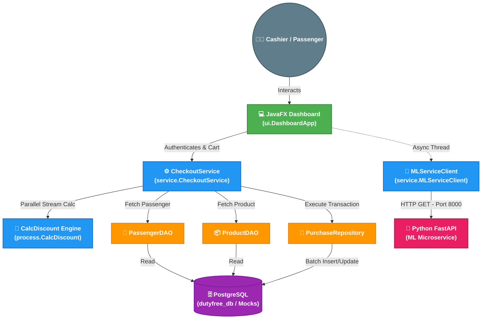

# Interactive System Architecture Sketch

Below is an interactive sketch of the Airport Duty-Free Purchasing System. It outlines the flow of data from the User Interface down to the Database and external microservices.

> [!TIP]
> You can interact with the diagram by scrolling to zoom or dragging to pan if your viewer supports it. The colors represent different architectural layers.

## High-Level Architecture Flow

### Legend
*   **Green**: Presentation Layer (UI)
*   **Blue**: Business Logic & Service Layer
*   **Orange**: Data Access Layer (DAOs)
*   **Purple**: Core Persistence (Database)
*   **Pink**: External Microservices (Machine Learning)
